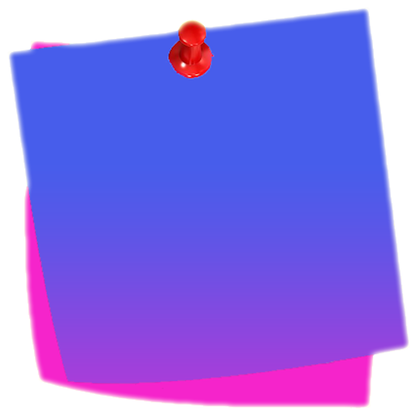
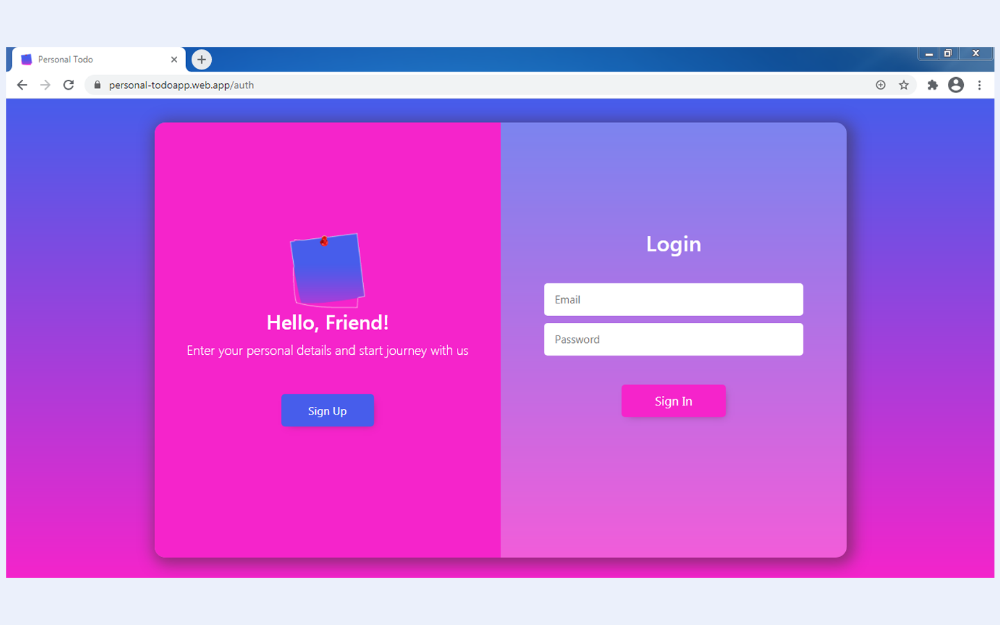
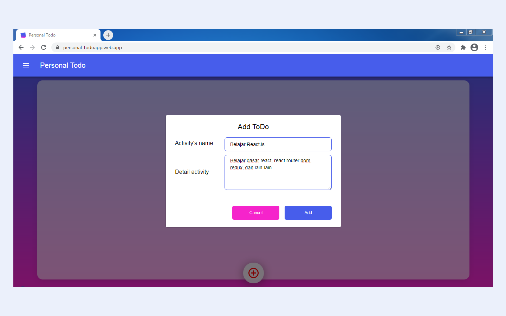
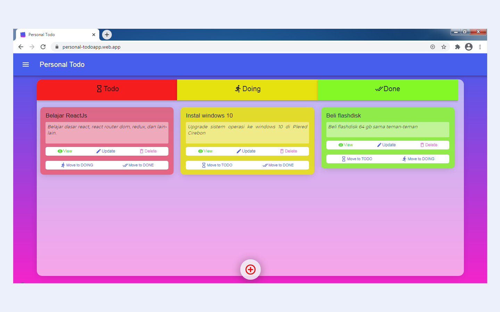
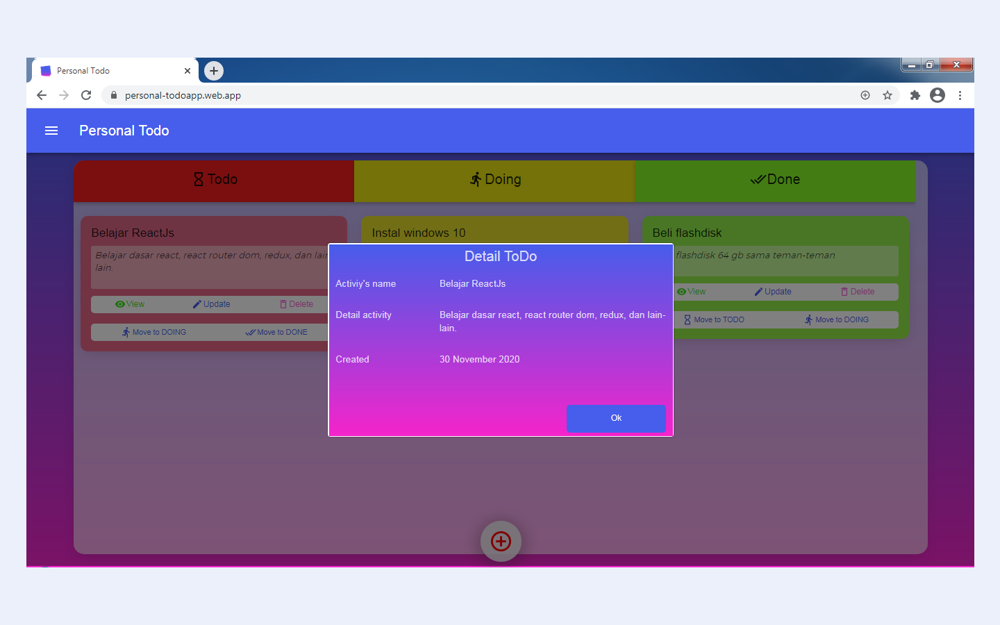

# Personal Todo 

<div align="center">
    
</div>

## Contents

- [Description](#description)
- [Build with](#build-with)
- [Features](#features)
- [Requirements](#requirements-for-development)
- [Installation](#installation-for-development)
- [Screenshoots](#screenshoots)
- [Demo PersonalTodo App](#demo-personaltodo-app)

## Description

**Personal Todo** is an application that is used to make it easier to manage our
list of activities or todos. You can add todo, update, delete, or set todo
status. The term "TODO" is used for activities that will be done, "DOING" for
activities that are being done, and "DONE" is for activities that have been
done.

This web project is a progressive web application, so you can install or add to
mobile home screen.

## Build with

- 
- 
- 
- 
- 
- and others

## Features

- Email verification
- Add, update, and delete todo
- Manage status todo (todo, doing, or done)

## Requirements for Development

- [`Node Js`](https://nodejs.org/en/)
- [`npm`](https://www.npmjs.com/get-npm)
- [`ReactJs`](https://reactjs.org/)

## Installation for Development

1. Open your terminal or command prompt
2. Type `git clone https://github.com/solehudin5699/PersonalTodo.git`
3. Open the folder and type `npm install` for install dependencies
4. Create file **_firebase.js_** in src/services directory with the following
   contents :

```javascript
import firebase from "firebase";
const firebaseConfig = {
  apiKey: "your_app_apiKey",
  authDomain: "your_auth_domain_app.firebaseapp.com",
  databaseURL: "your_app_database_URL.firebaseio.com",
  projectId: "your_app_projectID",
  storageBucket: "your_app_storageBucket",
  messagingSenderId: "your_app_messagingSenderId",
  appId: "your_appId",
};

const firebaseApp = firebase.initializeApp(firebaseConfig);
const db = firebaseApp.firestore();
const auth = firebase.auth();
const provider = new firebase.auth.GoogleAuthProvider();

export { auth, provider };
export default db;
```

5. Type `npm start` in terminal for running this project.
6. If you want to build, type `npm run build`.

## Screenshoots

|  |  |
| -------------------------------------------------- | -------------------------------------------------- |
|  |  |

|  |
 |
 | |
---------------------------------------------------- |
---------------------------------------------------- |
---------------------------------------------------- |

## Demo PersonalTodo App

This is PersonalTodo App build version,sign up and then login for trying it.

<a href="https://personal-todoapp.web.app">
  
</a>
